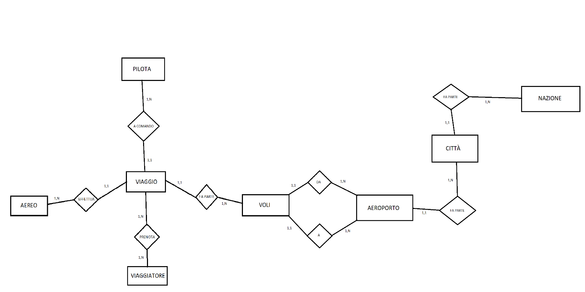
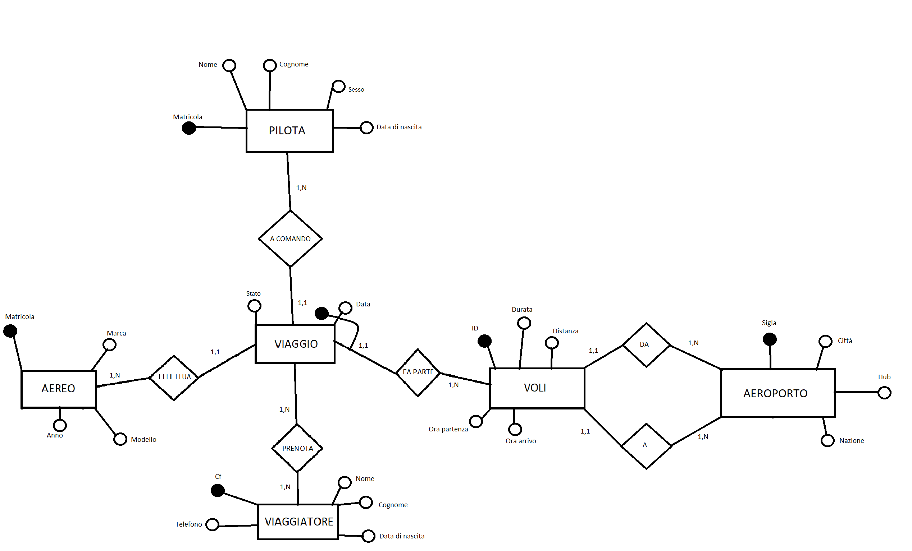

# Air Italy Database Management System


## Project Context

This project was developed for the **Database** course during the **2022-2023 academic year**. The assignment required students to design and implement a complete database system using SQL, demonstrating proficiency in:

- **Database Design**: From conceptual modeling (ER diagrams) to physical implementation
- **SQL Development**: Creating comprehensive DDL scripts for schema creation
- **Data Management**: Developing DML scripts to populate the database with realistic sample data
- **Query Development**: Writing complex SQL queries to demonstrate database functionality and analytical capabilities

The project deliverables included:
- Database schema creation scripts (DDL)
- Data population scripts (DML) 
- Example queries showcasing various SQL operations and business logic

## Introduction

This project presents the design and implementation of a comprehensive database management system for **Air Italy**, a fictional airline company. The database is designed to efficiently manage all core aspects of airline operations, including flight scheduling, aircraft management, pilot assignments, passenger bookings, and airport operations.

The project demonstrates a complete database development lifecycle, starting from requirements analysis through conceptual design (Entity-Relationship modeling), logical design (relational schema), and physical implementation using MySQL. The system handles complex relationships between entities such as flights, trips (flight instances), airports, aircraft, pilots, passengers, and bookings, incorporating proper normalization techniques and constraint enforcement to ensure data integrity.

Key features of the system include:
- **Flight Management**: Definition of flight routes with departure/arrival airports, duration, and distance
- **Trip Scheduling**: Management of actual flight instances on specific dates with pilot and aircraft assignments
- **Resource Management**: Tracking of aircraft fleet and pilot assignments with conflict prevention
- **Passenger Services**: Booking system linking passengers to specific trip instances
- **Operational Constraints**: Enforcement of business rules such as preventing double-booking of pilots and aircraft

The database design follows best practices in relational database modeling, ensuring scalability, maintainability, and data consistency through proper use of primary keys, foreign keys, and business logic constraints.

## Database Design (ER Diagrams)

The database design evolved through multiple iterations, starting from a basic skeleton to a comprehensive final schema:

### Conceptual Evolution

**Initial Skeleton Schema**


The initial design established the core entities and their basic relationships, providing the foundation for further refinement.

**Intermediate Schema** 


The intermediate version expanded on the initial design by adding essential attributes and refining relationships between entities.

**Final ER Diagram**


The final schema represents the complete conceptual model with all entities, attributes, relationships, and cardinalities fully specified. This diagram shows the sophisticated relationship between flights (abstract route definitions) and trips (concrete flight instances), along with the complex booking system.

## Logical Schema

The logical design translates the conceptual ER model into a relational schema. The database consists of seven main tables:

### Core Tables

**AIRPORT** (code, city, hub, country)
- Primary Key: code
- Manages airport information including hub status and geographical location

**FLIGHT** (id, duration, distance, departureTime, arrivalTime, departureAirport, arrivalAirport)
- Primary Key: id
- Defines abstract flight routes between airports with timing and distance data
- Foreign Keys: departureAirport, arrivalAirport → AIRPORT(code)

**AIRCRAFT** (registration, manufacturer, model, year)
- Primary Key: registration
- Maintains aircraft fleet information with manufacturer details and age

**PILOT** (pilotId, firstName, lastName, gender, birthDate)
- Primary Key: pilotId  
- Stores pilot personal information and credentials

**PASSENGER** (fiscalCode, firstName, lastName, birthDate, phone)
- Primary Key: fiscalCode
- Customer information with unique contact details

### Operational Tables

**TRIP** (flightId, flightDate, status, aircraftRegistration, pilotId)
- Primary Key: (flightDate, flightId)
- Represents actual flight instances on specific dates
- Foreign Keys: flightId → FLIGHT(id), pilotId → PILOT(pilotId), aircraftRegistration → AIRCRAFT(registration)
- Unique Constraints: (flightDate, pilotId), (flightDate, aircraftRegistration) - prevents resource conflicts
- Status Values: 'completed', 'in progress', 'scheduled'

**BOOKING** (bookingId, passengerFiscalCode, flightId, flightDate)
- Primary Key: bookingId
- Links passengers to specific trip instances
- Foreign Keys: passengerFiscalCode → PASSENGER(fiscalCode), (flightId, flightDate) → TRIP(flightId, flightDate)
- Unique Constraint: (passengerFiscalCode, flightId, flightDate) - prevents duplicate bookings

## Physical Schema (Implementation)

The physical implementation uses MySQL with InnoDB storage engine for transaction support and foreign key constraints. Here are key examples of the table creation scripts:

### Trip Table - Complex Relationships and Constraints
```sql
CREATE TABLE IF NOT EXISTS trip (
	flightId char(5) NOT NULL,
	flightDate date NOT NULL,
	status enum ('completed', 'in progress', 'scheduled'),
	aircraftRegistration char(4) NOT NULL,
	pilotId char(4) NOT NULL,
	PRIMARY KEY (flightDate, flightId),
    FOREIGN KEY (flightId) REFERENCES flight (id),
    FOREIGN KEY (pilotId) REFERENCES pilot (pilotId),
    FOREIGN KEY (aircraftRegistration) REFERENCES aircraft (registration),
	UNIQUE KEY (flightDate, pilotId),
	UNIQUE KEY (flightDate, aircraftRegistration)
) ENGINE=InnoDB DEFAULT CHARSET=utf8mb4 COLLATE=utf8mb4_0900_ai_ci;
```

### Booking Table - Multi-Column Foreign Keys
```sql
CREATE TABLE IF NOT EXISTS booking (
	bookingId char(5) NOT NULL,
    passengerFiscalCode char(16) NOT NULL,
    flightId char(5) NOT NULL,
	flightDate date NOT NULL,
    PRIMARY KEY (bookingId),
    FOREIGN KEY (passengerFiscalCode) REFERENCES passenger (fiscalCode),
    FOREIGN KEY (flightId) REFERENCES trip (flightId),
    FOREIGN KEY (flightDate) REFERENCES trip (flightDate),
    UNIQUE KEY (passengerFiscalCode, flightId, flightDate)
) ENGINE=InnoDB DEFAULT CHARSET=utf8mb4 COLLATE=utf8mb4_0900_ai_ci;
```

### Key Design Features:
- **Composite Primary Keys**: The trip table uses (flightDate, flightId) as primary key to uniquely identify flight instances
- **Resource Conflict Prevention**: Unique constraints on (flightDate, pilotId) and (flightDate, aircraftRegistration) prevent double-booking
- **Referential Integrity**: Comprehensive foreign key relationships maintain data consistency
- **Enumerated Values**: Status field uses ENUM type for controlled vocabulary
- **Unicode Support**: UTF8MB4 charset supports international characters in names and locations

## How to Use

### Database Setup

1. **Create the Database Schema**
   ```bash
   mysql -u username -p < "DB Creation.sql"
   ```
   This script will:
   - Drop any existing `airitaly` database
   - Create a new `airitaly` database
   - Create all tables with proper constraints and relationships

2. **Populate with Sample Data**
   ```bash
   mysql -u username -p airitaly < "Data Insert.txt"
   ```
   This will insert sample data including:
   - 25 airports across Europe
   - 20 flight routes
   - 30 aircraft in the fleet
   - 30 pilots
   - 50 passengers
   - 50 trip instances
   - 20 sample bookings

### Execution Order
⚠️ **Important**: Always execute `DB Creation.sql` before `Data Insert.txt` to ensure proper table structure exists before data insertion.

### System Requirements
- MySQL 5.7+ or MySQL 8.0+
- InnoDB storage engine support
- UTF8MB4 character set support

## Example Queries

The system supports complex analytical queries for operational reporting and management insights:

### Pilot Performance Analysis
```sql
-- Show pilots and the number of trips they conducted in March.
-- Pilots are ordered in descending order by the number of trips
SELECT p.pilotId, p.firstName, p.lastName, COUNT(*) AS tripCount
FROM trip t
JOIN pilot p ON t.pilotId = p.pilotId
WHERE MONTH(t.flightDate) = 3
GROUP BY p.pilotId
ORDER BY tripCount DESC;
```

### Customer Booking Analysis
```sql
-- Show, for each passenger, how many bookings they made for trips in March
SELECT v.fiscalCode, v.firstName, v.lastName, COUNT(*) AS bookingCount
FROM booking b
JOIN passenger v ON b.passengerFiscalCode = v.fiscalCode
WHERE MONTH(b.flightDate) = 3
GROUP BY v.fiscalCode;
```

### Operational Reporting
```sql
-- Show the number of flights departing from Italian airports
SELECT COUNT(*) AS totalFlightsFromItaly
FROM flight 
JOIN airport ON flight.departureAirport = airport.code 
WHERE airport.country = 'Italy';
```

### Real-time Operations
```sql
-- Show all trips currently in progress
SELECT *
FROM trip
WHERE status = 'in progress';
```

These queries demonstrate the system's capability to:
- Generate performance reports for crew management
- Analyze customer behavior and booking patterns  
- Provide operational insights for route planning
- Support real-time monitoring of flight operations

## Technical Notes

- **Database Engine**: MySQL with InnoDB for ACID compliance and foreign key support
- **Character Encoding**: UTF8MB4 for full Unicode support including emojis and international characters
- **Normalization**: Database follows 3NF principles to minimize redundancy
- **Indexing**: Primary keys and foreign keys provide efficient query performance
- **Constraint Enforcement**: Business rules implemented through database constraints rather than application logic

## Project Structure

```
/
├── DB Creation.sql          # DDL script for schema creation
├── Data Insert.txt          # DML script for sample data population  
├── Query Exemples.txt       # Sample queries and usage examples
├── README.md               # This documentation
└── assets/                 # ER diagram images (to be created)
    ├── schema-skeleton.png
    ├── schema-intermediate.png
    └── schema-final.png
```

## Project Requirements Fulfillment

This implementation successfully meets all course requirements:

✅ **Complete SQL Database Design** - Comprehensive schema with 7 interconnected tables  
✅ **DDL Script Development** - `DB Creation.sql` creates full database structure with constraints  
✅ **DML Script Development** - `Data Insert.txt` populates database with realistic sample data  
✅ **Query Examples** - `Query Exemples.txt` demonstrates various SQL operations and analytical queries  
✅ **Documentation** - Comprehensive technical documentation and usage instructions  

The project demonstrates advanced database concepts including:
- Complex foreign key relationships and referential integrity
- Business logic enforcement through database constraints
- Composite primary keys and unique constraints
- Normalized database design following 3NF principles
- Analytical queries with joins, aggregations, and filtering

## 👨‍💻 Author

Lorenzo Comis

## 📄 License

This project is licensed under the MIT License - see the [LICENSE](LICENSE) file for details.

---

*This project was developed for the Database course (Academic Year 2022-2023), demonstrating practical application of database design principles and SQL implementation techniques.*